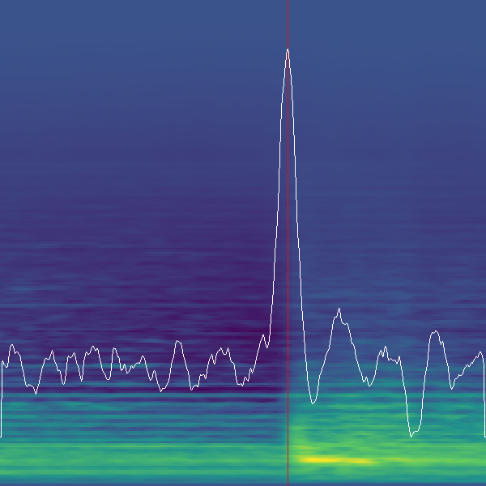
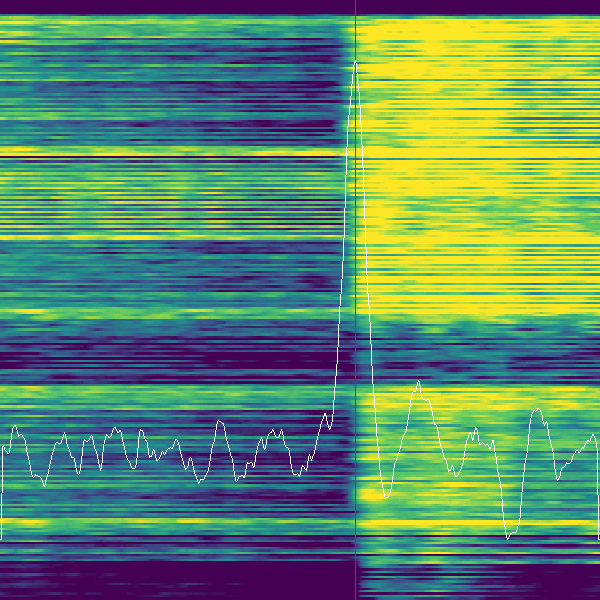
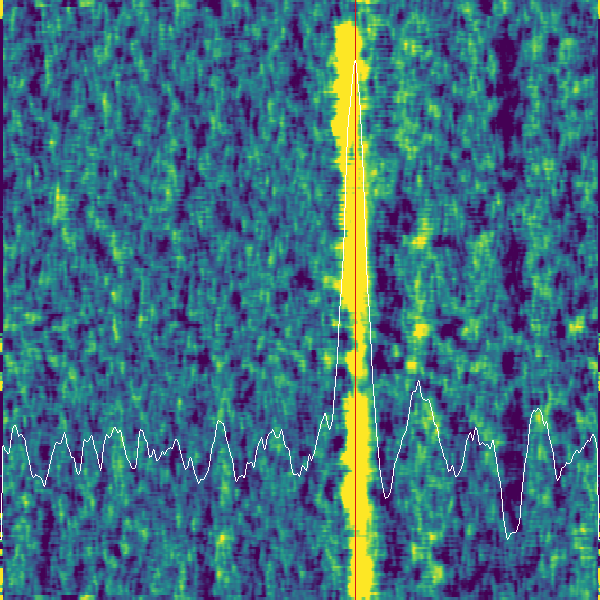
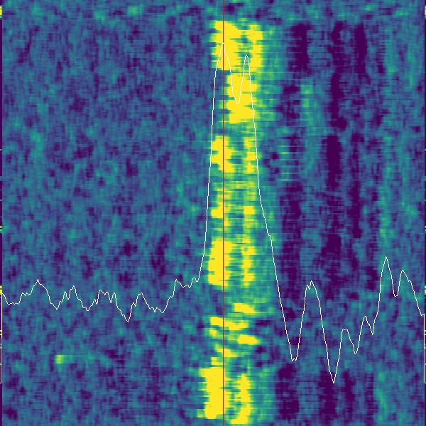
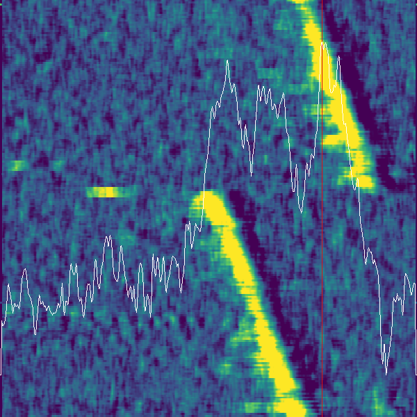

# null-or-die (`nod`)

`nod` is a terminal-first Rust reimplementation of [`nine-or-null`](https://github.com/telperion/nine-or-null) by [@telperion](https://github.com/telperion). It determines whether a StepMania simfile's sync bias is **+9ms** (In The Groove) or **null** (general StepMania), and reports the result with a confidence score.

***It is not meant to perform a millisecond-perfect sync!*** Please don't depend on the exact value you get from it. Instrument attacks vary significantly, and the algorithm is not smart enough to know what to focus on.

## Why this project exists

1. Performance advantages from implementing the sync-analysis pipeline in Rust.
2. Acting as a submodule/integration target for [`deadsync`](https://github.com/pnn64/deadsync), the Rust rewrite of ITGmania/StepMania.

## Background

In The Groove's engine introduced a ~9ms timing offset relative to StepMania's native timing. This means simfiles sync'd for one engine will feel slightly off on the other. You can read more about the origins of this bias:

- [Club Fantastic Wiki's explanation](https://wiki.clubfantastic.dance/Sync#itg-offset-and-the-9ms-bias)
- [Ash's discussion of solutions @ meow.garden](https://meow.garden/killing-the-9ms-bias)

## How does it work?

The seed concept is a visual representation first implemented (as far as we can tell) by beware, of beware's DDR Extreme fame.

1. **Parse the simfile** — identify the time that each beat occurs using [`rssp`](https://github.com/pnn64/rssp) to extract offset, BPMs, stops, and per-chart timing.
2. **Decode the audio** — load the OGG file via `ffmpeg` (preferred) or `lewton` (pure-Rust fallback) and convert to mono PCM.
3. **Compute the spectrogram** — STFT via `rustfft` with configurable window and step sizes.
4. **Build the sync fingerprint** — snip a small window around each beat time out of the spectrogram and stack them:
    - **Beat digest**: Flatten the frequencies (after filtering ultra-high/-low bands) and let Y be the beat index. The most helpful visual.
    - **Accumulator**: Sum the window and keep frequency as the Y coordinate. A sanity check.
5. **Apply a time-domain convolution** to identify the audio feature the simfile is sync'd to:
    - **Rising edge** (default): The most reliable kernel.
    - **Local loudness**: A more naive approach — easier to fool, but available.
6. **Detect the peak** — the time at the highest convolution response is the sync bias.
7. **Classify the paradigm** — check whether the bias lies within a tolerance interval around +9ms or 0ms. If neither, the result is ambiguous (`????`).
8. **Score confidence** — a statistical metric of how clear-cut the peak is.
9. **Visualize** — optionally write three PNG heatmaps per chart.

## Installation

### Building from source

```bash
cargo build --release
```

The binary is at `target/release/null-or-die` (or `null-or-die.exe` on Windows).

### ffmpeg (optional but recommended)

`nod` prefers [`ffmpeg`](https://ffmpeg.org/download.html) for audio decoding. If `ffmpeg` is not on `PATH`, it falls back to `lewton` (pure-Rust Ogg Vorbis decoder). For non-OGG audio formats, ffmpeg is required.

You can force a decoder via the `NOD_AUDIO_DECODER` environment variable (see [Environment Variables](#environment-variables)).

## CLI Reference

### `analyze`

Scan simfiles, parse chart metadata, decode audio, and compute bias metrics.

```bash
nod analyze <path> [options]
```

`<path>` can be a directory (recurse into all simfiles) or a single `.sm`/`.ssc` file.

#### Output

| Flag | Description | Default |
|------|-------------|---------|
| `--plot` | Generate nine-or-null-style heatmap PNGs | off |
| `-r, --report-path <dir>` | Directory for plot output | `<path>/../__bias-check` |
| `-o, --output <file>` | JSON report file | stdout |

#### Paradigm

| Flag | Description | Default |
|------|-------------|---------|
| `--to-paradigm <null\|+9ms>` | Force paradigm classification | auto-detect |
| `--consider-null` | Include null paradigm | true |
| `--consider-p9ms` | Include +9ms paradigm | true |
| `-t, --tolerance <ms>` | Tolerance band for paradigm matching | 4.0 |

#### Analysis parameters

| Flag | Description | Default |
|------|-------------|---------|
| `-c, --confidence <0-1>` | Minimum confidence threshold | 0.80 |
| `-f, --fingerprint <ms>` | Fingerprint window half-width | 50.0 |
| `-w, --window <ms>` | Spectral window size | 10.0 |
| `-s, --step <ms>` | Spectrogram step size | 0.2 |
| `--magic-offset <ms>` | Timing offset calibration | 0.0 |
| `--kernel-target <digest\|acc>` | Convolution target | digest |
| `--kernel-type <rising\|loudest>` | Convolution kernel | rising |
| `--full-spectrogram` | Save full spectrogram (memory intensive) | off |

### `parity`

Validate native bias outputs against baseline fixtures.

```bash
nod parity <path> -b <baseline-dir> [options]
```

| Flag | Description |
|------|-------------|
| `-b, --baseline <dir>` | MD5-sharded baseline directory |
| `-o, --output <file>` | JSON report file |
| `--fail-on-missing` | Exit non-zero if baseline files are missing |
| `--fail-on-mismatch` | Exit non-zero if outputs differ from baseline |
| `--bias-only` | Compare only bias values (skip confidence/convolution) |

### `harness`

Run the Python `nine-or-null` reference implementation and write canonical `.json.zst` baseline fixtures.

```bash
nod harness <path> -b <baseline-dir> [options]
```

| Flag | Description | Default |
|------|-------------|---------|
| `-b, --baseline <dir>` | Output baseline directory | — |
| `--python <bin>` | Python executable | `python3` |
| `--source-root <dir>` | Path to `nine-or-null/` Python package | auto-detect |
| `--scratch <dir>` | Temporary working directory | auto |
| `--keep-scratch` | Keep scratch files after run | off |
| `--overwrite` | Overwrite existing baselines | off |
| `--zstd-level <1-22>` | Compression level | 19 |

Also accepts all analysis parameters (`-f`, `-w`, `-s`, `--magic-offset`, `--kernel-target`, `--kernel-type`, `--full-spectrogram`, `--consider-null`, `--consider-p9ms`, `-t`).

### `bench`

Profile analysis performance on a single simfile.

```bash
nod bench <simfile> [options]
```

| Flag | Description | Default |
|------|-------------|---------|
| `-n, --iterations <n>` | Number of timed runs | 20 |
| `--warmup <n>` | Warmup runs (excluded from stats) | 3 |
| `-o, --output <file>` | JSON report file | stdout |

Also accepts `-f`, `-w`, `-s`, `--magic-offset`, `--kernel-target`, `--kernel-type`, `--full-spectrogram`.

Reports min/avg/max milliseconds per phase: read, parse, decode, bias, total.

### `plot`

Render a bias-value distribution histogram from a JSON report.

```bash
nod plot <input.json> <output.png> [options]
```

| Flag | Description | Default |
|------|-------------|---------|
| `--width <px>` | Image width | 1024 |
| `--height <px>` | Image height | 256 |
| `--span-ms <ms>` | Distribution range | 50.0 |

Searches for `bias_ms`, `bias_result`, or `bias` keys in the JSON recursively.

### Legacy invocation

Flag-style invocation is also supported for backwards compatibility:

```bash
nod --analyze /path/to/song.sm --plot
```

## Environment Variables

| Variable | Description |
|----------|-------------|
| `NOD_AUDIO_DECODER` | Force audio backend: `ffmpeg` or `lewton`. If unset, tries ffmpeg first with lewton fallback. |
| `NOD_BIAS_TRACE` | Enable trace-level bias debugging output (`1` to enable). |
| `NOD_BIAS_TRACE_KEEP` | Number of trace files to retain. |
| `NOD_BIAS_TRACE_FILTER` | Comma-separated tokens to filter trace output to matching charts. |
| `NOD_BIAS_TRACE_DIR` | Directory for trace JSON output files. |

## Interpreting the Plots

`nod analyze --plot` yields three PNG heatmaps for each chart. You can also find them in the report directory (default `__bias-check`, or set via `--report-path`).

### Common features

All three plots share these elements:

- **X-axis** (horizontal) represents the time neighborhood of the downbeat according to the timing data (offset, BPMs, stops, etc.). Zero is expected to be "on-beat" under a null sync paradigm; if your files are ITG sync'd, the attack should appear ~9ms to the right.
    - A simfile will feel **"late"** if the attack lies to the left of your paradigm's neutral (preceding the step time), and **"early"** if it's to the right.
- **Color** represents audio level after processing. Purple is low, yellow is high.
- The **white squiggly line** is the algorithm's convolution response. Its highest point is the detected sync bias.
- A **red vertical line** marks the detected bias position.

### Spectrogram average

The spectrogram of each downbeat's neighborhood, stacked and averaged. Frequency on Y-axis, local time on X-axis. A sanity check — the highest energy should lie immediately to the right of the bias line.



### Beat digest

Each downbeat's frequency-flattened energy as a horizontal line, stacked vertically by beat index. Y-axis is "coarse time" (beat index, progressing bottom to top), X-axis is "fine time". A well-synced file produces a vertical stripe of yellow to the right of the bias line.



### Convolution response

The most informative plot. Yellow represents high algorithmic response to the audio; the horizontal position with the most response overall is identified as the sync bias.



How to read it:

- **A narrow, sharply vertical yellow stripe** = crisp sync. Good!
    - The stripe can be patchy or wavy, but as long as it's strongly vertical, the sync should feel consistent. (Different instrumentation or human performers often cause this.)



- **A tilted yellow stripe** indicates the BPM is slightly off; if the tilt is clearly visible, it's probably off by at least 0.01 or two.
    - Upward tilt to the right ↗ = chosen BPM too high.
    - Upward tilt to the left ↖ = chosen BPM too low.
- **Large discontinuities** (jumps) in the stripe can indicate song cut errors, incorrect stop values, or other sudden offset shifts.
- You might get a little from column A *and* a little from column B...



## Confidence

Not every track has a sharply defined beat throughout. The sync fingerprint might pinpoint the attack clearly for one track, but show a lot of uncertainty for another — or the simfile might not define the correct BPMs. Since `nod` is only interested in offset identification, we don't want to act on files that are unclear. A **confidence metric** quantifies this.

### What makes a good confidence metric?

What could cause the algorithm to pick the wrong sync bias?

- How much of a clear winner is the chosen attack time? If there's high response in the neighborhood (a ringing attack, a two-part clap sound), the peak is harder to isolate.
- Is the competing response far enough away from the chosen peak that it would actually impact the sync?

### How nod computes confidence

The confidence score combines two statistical measurements of the convolution response:

- **Quantile distance** (`conv_quint`): How far the peak stands above the response's interquartile range. Low values = sharp, dominant peak.
- **Standard deviation** (`conv_stdev`): Overall spread of the response. Low values = concentrated energy.

A peak stabilization step prevents jitter when nearby bins have near-equal response. The final confidence is clamped to a theoretical upper bound of 83% (0.83) to reflect inherent algorithmic uncertainty.

### What the numbers mean

- **High confidence** (e.g. 0.98): plot shows a sharp vertical stripe with a clear peak. The algorithm is very sure.
- **Low confidence** (e.g. 0.40): messy or ambiguous plot. The result may not be reliable.
- **100% does not mean correct** — just that the algorithm can't see anything to contradict itself.

Use `--confidence` to set the minimum threshold for trusting results (default: 0.80). In JSON output, confidence is expressed as a proportion out of 1.0.

## Library API

`nod` exposes a Rust API for in-engine sync tooling (e.g., [`deadsync`](https://github.com/pnn64/deadsync)):

```rust
use nod::api::{inspect_simfile, analyze_chart, default_bias_cfg};
use std::path::Path;

let path = Path::new("song.sm");

// List available charts
let charts = inspect_simfile(path)?;

// Analyze a specific chart
let cfg = default_bias_cfg();
let result = analyze_chart(path, 0, &cfg)?;
println!("bias: {:.2} ms, confidence: {:.2}", result.estimate.bias_ms, result.estimate.confidence);
```

### Streaming API

For real-time rendering (e.g., in a game engine UI), use the streaming interface:

```rust
use nod::api::analyze_chart_stream;
use nod::bias::{BiasStreamCfg, BiasStreamEvent};

let stream_cfg = BiasStreamCfg::default();
let result = analyze_chart_stream(path, 0, &cfg, stream_cfg, |event| {
    match event {
        BiasStreamEvent::Init(init) => { /* set up rendering */ }
        BiasStreamEvent::Beat(beat) => { /* draw a new beat row */ }
        BiasStreamEvent::Convolution(conv) => { /* draw post-kernel heatmap */ }
        BiasStreamEvent::Done(estimate) => { /* show final result */ }
    }
})?;
```

Use `stream_cfg.orientation` (`Vertical` or `Horizontal`) as display intent in your UI layer.

### API surface

| Function | Description |
|----------|-------------|
| `inspect_simfile(path)` | Chart metadata for UI/selection |
| `analyze_chart(path, index, &cfg)` | Full bias estimate + plot matrices |
| `analyze_chart_stream(path, index, &cfg, stream_cfg, on_event)` | Incremental events while processing |
| `analyze_chart_with_runtime(path, index, &cfg, &mut runtime)` | Reuse cached spectrograms across charts |
| `default_bias_cfg()` | Sensible default configuration |

## Baseline Layout

MD5-sharded baseline lookup matches the existing `rssp` corpus style:

```
<baseline>/<md5[0..2]>/<md5>.json       # or .json.zst
```

MD5 is computed from raw simfile bytes. Baseline chart rows include a `music` field (chart `#MUSIC` if present, else simfile `#MUSIC`) so split-audio parity can target the correct OGG per chart.

## Examples

```bash
# Analyze a single song, print JSON report to stdout
nod analyze /path/to/Songs/Euphoria

# Analyze with plots
nod analyze /path/to/song.sm --plot --report-path /tmp/nod-plots

# Analyze an entire pack
nod analyze /path/to/Songs --output /tmp/nod-scan.json

# Validate against baselines
nod parity /path/to/Songs --baseline /path/to/baseline --fail-on-missing --fail-on-mismatch

# Generate Python reference baselines
nod harness /path/to/Songs --baseline /path/to/baseline --source-root /path/to/nine-or-null/nine-or-null

# Benchmark a single simfile
nod bench "/path/to/song.sm" --warmup 3 --iterations 20

# Plot bias distribution from a JSON report
nod plot /tmp/nod-scan.json /tmp/bias.png --span-ms 20
```
